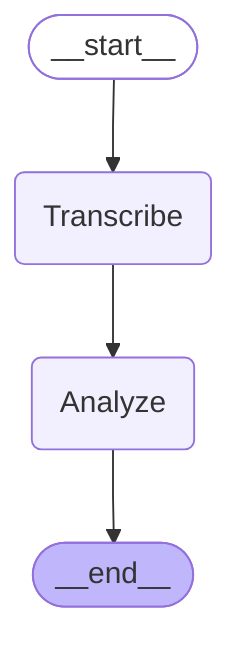

```mermaid
---
config:
  flowchart:
    curve: linear
---
graph TD;
	__start__([<p>__start__</p>]):::first
	Transcribe(Transcribe)
	Analyze(Analyze)
	__end__([<p>__end__</p>]):::last
	Transcribe --> Analyze;
	__start__ --> Transcribe;
	Analyze --> __end__;
	classDef default fill:#f2f0ff,line-height:1.2
	classDef first fill-opacity:0
	classDef last fill:#bfb6fc
```