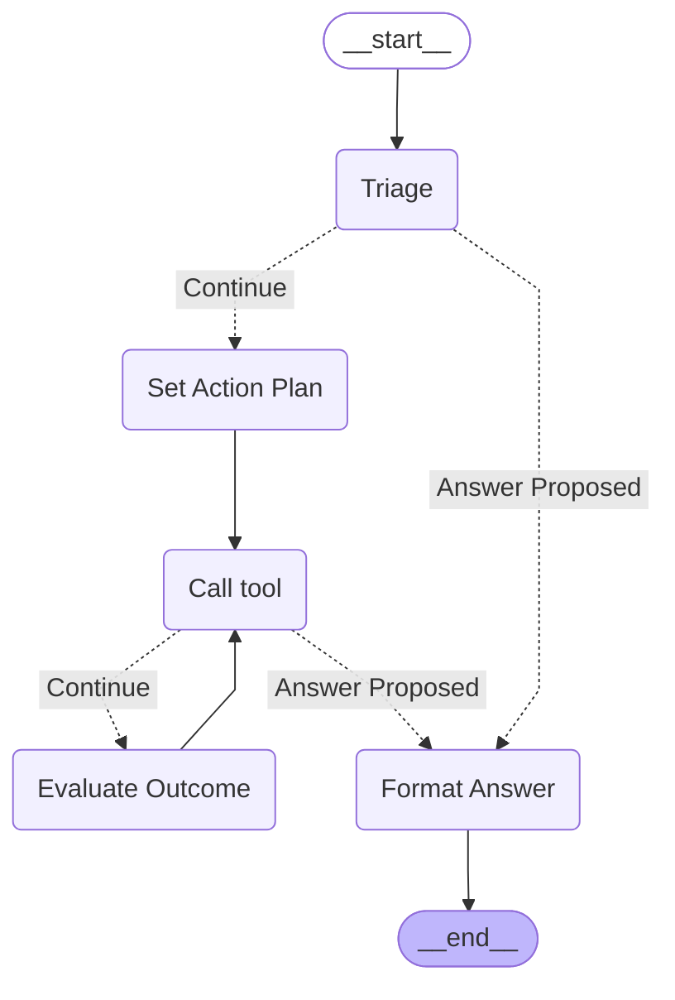

```mermaid
---
config:
  flowchart:
    curve: linear
---
graph TD;
	__start__([<p>__start__</p>]):::first
	Triage(Triage)
	Set_Action_Plan(Set Action Plan)
	Call_tool(Call tool)
	Evaluate_Outcome(Evaluate Outcome)
	Format_Answer(Format Answer)
	__end__([<p>__end__</p>]):::last
	Call_tool -. &nbsp;Continue&nbsp; .-> Evaluate_Outcome;
	Call_tool -. &nbsp;Answer Proposed&nbsp; .-> Format_Answer;
	Evaluate_Outcome --> Call_tool;
	Set_Action_Plan --> Call_tool;
	Triage -. &nbsp;Answer Proposed&nbsp; .-> Format_Answer;
	Triage -. &nbsp;Continue&nbsp; .-> Set_Action_Plan;
	__start__ --> Triage;
	Format_Answer --> __end__;
	classDef default fill:#f2f0ff,line-height:1.2
	classDef first fill-opacity:0
	classDef last fill:#bfb6fc
```