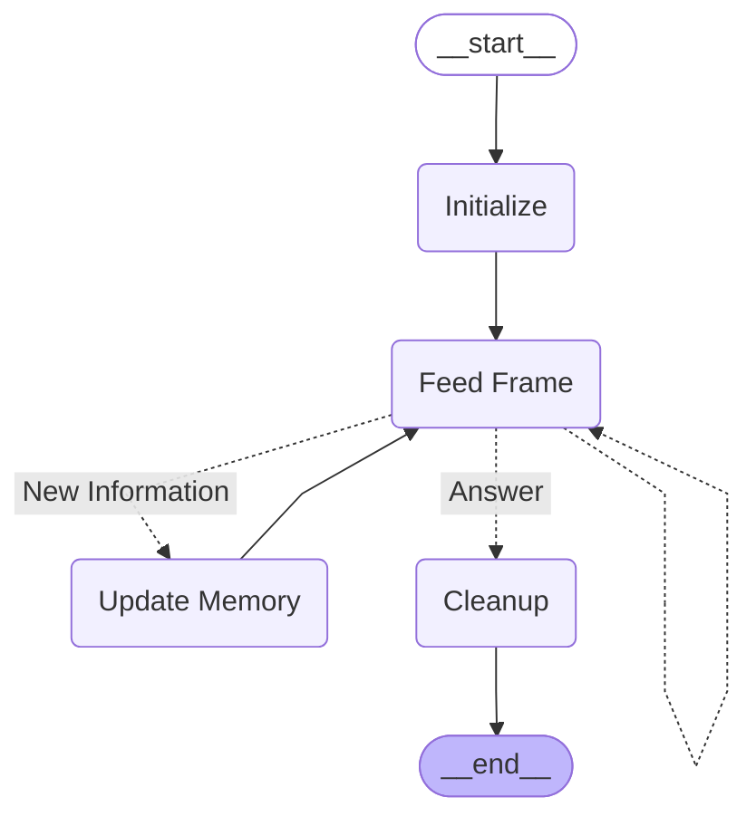

```mermaid
---
config:
  flowchart:
    curve: linear
---
graph TD;
	__start__([<p>__start__</p>]):::first
	Initialize(Initialize)
	Feed_Frame(Feed Frame)
	Update_Memory(Update Memory)
	Cleanup(Cleanup)
	__end__([<p>__end__</p>]):::last
	Feed_Frame -. &nbsp;Answer&nbsp; .-> Cleanup;
	Feed_Frame -. &nbsp;New Information&nbsp; .-> Update_Memory;
	Initialize --> Feed_Frame;
	Update_Memory --> Feed_Frame;
	__start__ --> Initialize;
	Cleanup --> __end__;
	Feed_Frame -.-> Feed_Frame;
	classDef default fill:#f2f0ff,line-height:1.2
	classDef first fill-opacity:0
	classDef last fill:#bfb6fc
```